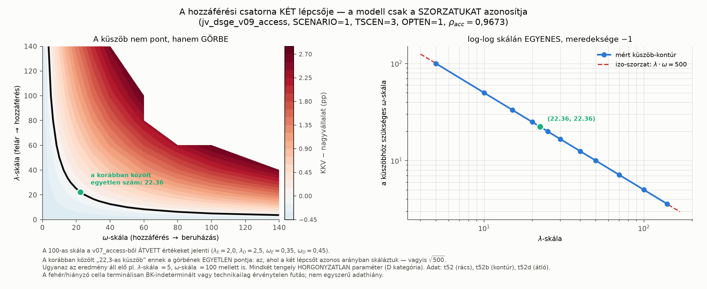

# Az `ACCSCALE` szétbontása: a küszöb nem szám, hanem izo-szorzat görbe

*2026-08-24 · a [korlátok-riport](../terv/2026-08-21_korlatok_es_teendok.md) 1. teendője*
*Kód: `src/modell/1_fo_vonal_jv/futtato/sens_lam_om_v09.m` · ábra: `src/3_abrak/18_lam_om_felulet.py`*
*Táblák: `t52` (rács), `t52b` (kontúr), `t52c` (marginális), `t52d` (átló), `t52e` (szorzat-azonosság)*

> **KORREKCIÓ — 2026-08-24 (valódi Blanchard–Kahn-audit).** A történeti
> `konvergalt` jelzés itt is csak a perfect-foresight solver sikerét jelentette.
> Az `OPTEN=1`, `rho_acc=0,9673`, `ACCSCALE=100` pont **nem terminális
> BK-valid**, ezért az ezen a ponton közölt GDP- és szegmensszintek nem
> interpretálhatók modell-eredményként. A küszöbgeometria ettől nem esik
> el: a `t52b` izo-szorzat küszöbkontúrjának pontjai BK-validak, így a
> `lambda_acc·omega_acc` azonosítható szorzatára és a **22,36-os
> diagonális küszöbre** vonatkozó következtetés fennmarad. Az alábbi
> történeti szövegben az `ACCSCALE=100` pontszinteket ennek megfelelően
> diagnosztikai, nem közölhető modellkimenetként kell olvasni.

---

## A kiinduló probléma

Egyetlen szám (`ACCSCALE`) skálázta a hozzáférési csatorna **mindkét**
lépcsőjét:

```
lambda_acc_E = 2.0*(ACCSCALE/100);   lambda_acc_D = 2.5*(ACCSCALE/100);   // felár → hozzáférés
omega_acc_E  = 0.35*(ACCSCALE/100);  omega_acc_D  = 0.45*(ACCSCALE/100);  // hozzáférés → beruházás
```

Mivel a hosszú távú hatás `−ω·λ/(1−ρ)·efp`, a hatás az `ACCSCALE`
**négyzetével** arányos. Ezért a közölt „22,3-as küszöb" két rugalmasság
szorzatán ült, előre rögzített `λ:ω` arány mellett — és így nem volt
interpretálható.

**Megoldás:** két külön makró-kapcsoló, `-DLAMSCALE` és `-DOMSCALE`.
Alapértelmezésük `-1` = „nincs beállítva", ilyenkor mindkettő az
`ACCSCALE`-t örökli, tehát **minden korábbi eredmény bitre változatlan**
(lásd a regressziós őrt alább).

---

## 1. A várt eredmény: a marginális hatás lineáris, az együttes nem

Egyszerre egy lépcsőt mozgatva, a másikat 100-on tartva (`t52c`, OPTEN=1):

| skála | hatás/skála — **csak λ** | hatás/skála — **csak ω** | hatás/skála — **együtt** |
|---:|---:|---:|---:|
| 4 | 0,0835 | 0,0835 | 0,0035 |
| 20 | 0,0704 | 0,0704 | 0,0167 |
| 60 | 0,0525 | 0,0525 | 0,0369 |
| **BK-valid tartomány (4–60)** | **1,6×** | **1,6×** | **10,5×** |

Az együttes hanyados **nő** (kvadratikus), az egy-lépcsős **csökken**
(általános egyensúlyi tompítás). A kvadratikusság tehát a **közös skálázás
műterméke** volt, nem a modell tulajdonsága.

## 2. A nem várt eredmény, ami ennél élesebb

**A „csak λ" és a „csak ω" oszlop számjegyre azonos.** Ez nem véletlen:
a két paraméter kizárólag a **szorzatán** keresztül hat.

Ellenőrizve (`t52e`) egy BK-valid, 2500-as szorzatcsoporton: azonos
szorzatú, de nagyon különböző párok ugyanazt adják. `(λ,ω) = (50,50)`,
`(100,25)`, `(25,100)`, `(250,10)`, `(10,250)` — mind ugyanazt az
eredményt adja, és mind az öt pont BK-valid.

> ### Amit ebből ki kell mondani
>
> **A modell a `lambda_acc`-ot és az `omega_acc`-ot külön-külön NEM
> azonosítja, még elvben sem.** Bármilyen adat, ami a modellen keresztül
> horgonyozná őket, csak a szorzatra ad információt.
>
> A D kategória négy access-tétele (`lambda_acc_E/D`, `omega_acc_E/D`)
> ezért valójában **két** azonosítható objektum: `λ_E·ω_E` és `λ_D·ω_D`.

Ez **nem rontja** az eredményt — **javítja a közlést**: eddig egy nem
azonosítható objektumra adtunk küszöböt.

---

## 3. A küszöb új alakja

A nulla-kontúr (`t52b`, OPTEN=1, `rho_acc = 0,9673`, SCENARIO=1, TSCEN=3):

| λ-skála | küszöb ω-skála | szorzat |
|---:|---:|---:|
| 5 | 99,98 | 499,9 |
| 10 | 50,00 | 500,0 |
| 20 | 25,00 | 500,1 |
| **22,36** | **22,36** | **500,0** ← *ez a korábbi „22,3"* |
| 50 | 10,01 | 500,3 |
| 100 | 5,01 | 500,8 |
| 140 | 3,58 | 501,2 |

**A szorzat 28-szoros λ-tartományon 0,08%-on belül állandó.** A küszöb tehát
egy pontos izo-szorzat görbe (log-log skálán egyenes, meredeksége −1).

### A régi számokhoz kötve (`t52d`, regressziós híd)

| ág | átló (λ = ω) | a korábban közölt szám | szorzat |
|---|---:|---:|---:|
| OPTEN=1 (`rho_acc` = 0,9673) | **22,36** | 22,3 (`t48b`, `t51`) | 500,0 |
| OPTEN=0 (`rho_acc` = 0,85) | **36,56** | 36,5 (`t48b`) | 1336,7 |

A régi számok tehát nem hibásak — csak **egyetlen pontot** jelöltek egy
görbén, azt, ahol a két lépcsőt azonos arányban skáláztuk.



---

## A helyes közlési forma

> A KKV-blokk szegmens-kibocsátása akkor előzi meg a nagyvállalatit, ha a
> hozzáférési csatorna **két lépcsőjének szorzata** meghalad egy küszöböt:
> az átvett kalibrációhoz viszonyított skálán `(λ·ω)* = 500` a feltételes,
> magas-`rho_acc = 0,9673` érzékenységi ágban, és `1337` az átvett
> `rho_acc = 0,85` mellett.
> Ugyanaz az eredmény áll elő erős 1. lépcső + gyenge 2. lépcső mellett,
> mint fordítva — a modell a kettőt nem különbözteti meg.

Ez **szigorúbb** állítás, mint a korábbi, mert megmondja, mit NEM tudunk.

## Amit ez NEM old meg

- Az `ACCSCALE` továbbra is **horgonyzatlan** (`A06`) — csak most már
  tudjuk, hogy *mit* kellene horgonyozni: a szorzatot.
- A `λ_E:λ_D = 2,0:2,5` és `ω_E:ω_D = 0,35:0,45` **arányok** továbbra is
  átvettek, és ezeket ez a scan nem mozgatja. Külön teendő.
- Az `omega_acc_L = 0` feltevést ez a kapcsoló nem érinti (4. teendő).

---

## Regressziós őrök

| ellenőrzés | eredmény |
|---|---|
| `ACCSCALE=100` vs `LAM=100, OM=100` | eltérés 0 |
| `ACCSCALE=50` vs `LAM=50, OM=50` | eltérés 0 |
| a tárolt `t44` baseline-hoz | eltérés < 1e−9 |
| azonos szorzatú `(λ,ω)` párok (`t52e`) | eltérés numerikus nulla |
| az átló visszaadja a `t48b`/`t51` számait | 22,36 / 36,56 |

Mind az öt őr a füsttesztben fut.
